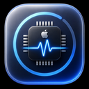

# PulseMonitor



A macOS hardware monitoring and control centre built to explain **why** a Mac is slow, not just show percentages.


## Version 3.0 — Professional Edition

Version 3 adds a digital twin, multi-category health scoring, an AI performance
copilot, game lab, hardware labs, snapshots/diff, workspaces, menu-bar studio,
and an optional token-gated local web dashboard — still without inventing sensors.

| Module | What it does |
|--------|--------------|
| **Health Score** | 0–100 across CPU/GPU/Battery/Storage/Memory/Cooling/Network/Power/Security/Software with change reasons |
| **Digital Twin** | Interactive SceneKit model; components colour by heat/load; predictions labeled as estimates |
| **AI Copilot** | Plain-language explanations grounded only in measured samples and findings |
| **Game Lab** | Session recording, library, shader-surge heuristics, Java/Minecraft process insights (no fake FPS) |
| **Snapshots** | One-click captures with side-by-side difference mode |
| **Hardware DB** | Model, CPU, GPU, memory, displays, USB, PCI from sysctl / IOKit / Metal |
| **USB / Bluetooth / Display Labs** | Live device lists; eject when BSD name exists; BT scan with RSSI; refresh-rate change detection |
| **WindowServer / Developer Lab** | Honest process-level cost only — no private GPU frame capture |
| **Packages** | Detects Homebrew, Python, Node, Java, Rust, Go, Swift toolchains on disk |
| **Workspaces** | Gaming / Programming / Battery / Monitoring / Streaming / Editing presets |
| **Menu Bar Studio** | Compose which metrics appear in the menu bar |
| **Web Dashboard** | Optional localhost HTTP UI with rotating auth token |
| **Log Analyzer** | Groups crash, thermal and sleep/wake events from the existing event log |
| **Universal Search** | Find modules, processes, hardware and commands from one field |

## Version 2.0 — Tahoe Update

Version 2 turns PulseMonitor from a monitor into a control centre: real SMC sensor
reads, a capability-gated system control panel, a benchmark suite, an automation
engine, and a floating overlay.

### What is new

| Module | What it does |
|--------|--------------|
| **Control Center** | Volume, mute, appearance, wallpaper, Dock, brightness — each gated on whether macOS actually permits it |
| **Fans & Sensors** | Live SMC fan RPM, temperature and power-rail readings on Intel Macs |
| **Profiles** | Seven monitoring profiles from Silent to Developer, changing sampling rate, thresholds, overlay and notifications |
| **Automation** | IF/THEN rules with cooldowns, logged every time they fire |
| **Optimizer** | Ranked, non-destructive suggestions from live metrics |
| **Applications** | Installed apps with architecture read from the Mach-O header and developer from the code signature |
| **Benchmarks** | CPU, memory, disk and Metal GPU tests with score history |
| **System Map** | Interactive subsystem graph with live values |
| **Timeline** | Scrub back through recorded history with a synced playhead |
| **Insights** | Narrative observations derived from recorded samples |
| **Logs** | Sleep/wake, mount, thermal and app events plus crash and panic reports |
| **Overlay** | Floating always-on-top readout with a game mode |
| **Widgets** | Custom dashboard of resizable gauges, graphs, clock, battery, fans and plugin sensors |
| **Plugins** | Discoverable plugin packages (`.pulsemonitorplugin`) plus a built-in uptime sensor |
| **Shortcuts** | App Intents for Start Monitoring, Overlay, Benchmark, Optimize, Snapshot and Export Report |
| **Live Wallpaper** | Optional slow in-app backdrop animation and a desktop image slideshow from a chosen folder |
| **Themes** | Eight themes including a true-black OLED mode |

Multi-window support lets any module be torn off into its own window from the
sidebar context menu or the Modules menu. File ▸ New Window reopens the main
window if you closed it while the menu bar item kept the app alive.

## What this app will not do

PulseMonitor never shows a control it cannot honour or a number it cannot
measure. Every gated feature states its reason in the UI:

| Feature | Status | Reason |
|---------|--------|--------|
| Manual fan control | Disabled | Apple Silicon blocks it outright. On Intel it needs a privileged SMC helper, which this app does not install. |
| Frame rate / FPS estimates | Not offered | Reading another app's frame rate requires private APIs or Metal's HUD. |
| Neural Engine load | Marked unavailable | No public utilization API. |
| Bluetooth codec / audio quality | Not offered | Not published by CoreBluetooth on macOS. |
| Night Shift / True Tone | Disabled | Controlled by the private CoreBrightness framework. |
| Do Not Disturb / Focus | Disabled | No public API exists. |
| Low Power Mode, sleep timers, GPU switching | Read-only | Readable via `pmset`; writing them needs administrator rights. |
| Keyboard backlight | Disabled | Only writable through a private framework. |
| Granted privacy permissions | Declaration only | The TCC database is protected; the app shows what an app *requests*, not what you granted. |
| Apple Shortcuts actions | Implemented | App Intents ship in the SPM binary; Shortcuts discovers them once the `.app` has been launched. |
| Third-party native code plugins | Catalogued only | Disk packages with Info.plist are listed and can be toggled; loading unsigned Mach-O plugin code is refused rather than faked. Built-in Swift plugins (uptime sensor) activate fully. |
| Custom widget canvas | Implemented | Users can add, resize and remove widgets; layout persists in UserDefaults. |

Capability detection lives in `CapabilityService` and `HostCapabilities`, and every
mutating feature resolves through it before any control is rendered.

## Measured overhead

Taken on a MacBook Pro 16,1 (Intel i7-9750H, 12 threads), main window open,
averaged over four fifteen-second intervals:

| Profile | Sampling | CPU (one core) | Memory |
|---------|----------|----------------|--------|
| Silent | 5 s | **2.07 %** | 99 MB |
| Balanced | 1 s | **5.3 %** | 105 MB |

On a twelve-thread machine 5.3 % of one core is roughly 0.4 % of total capacity.
Most of what remains at one-second sampling is SwiftUI chart rendering rather than
data collection; the process table is rebuilt on a slower three-second cadence
because a `proc_pidinfo` call per PID dominates the cost of a tick.

Sampling continues while the window is closed. The collector holds a
`ProcessInfo` activity assertion so App Nap cannot leave gaps in the history,
and it does not block sleep or display sleep.

## Architecture

```
MVVM + Services + Repository + Dependency Injection
Async/Await · Actors · Observation · Swift Charts
```

| Layer | Responsibility |
|-------|----------------|
| `Services/` | Mach, IOKit, SMC, sysctl, Metal, CoreAudio and libproc sampling |
| `Analysis/` | Bottleneck rules, insights, optimizer, automation, game detection |
| `Design/` | Theme engine, glass surfaces, shared components and motion tokens |
| `ViewModels/` | `@Observable` presentation state |
| `Views/` | SwiftUI modules |
| `HistoryRepository` | SQLite retention store |

## Requirements

- macOS 14 Sonoma or later
- Swift 6 toolchain (Xcode 16+ or Command Line Tools)
- Intel or Apple Silicon Mac

## Build & Run

```bash
./Scripts/bundle.sh
open build/PulseMonitor.app
```

The script builds a release binary, assembles the `.app` bundle, ad-hoc signs it
and clears the quarantine flag.

### A note on the Tahoe design language

This project builds against whichever macOS SDK is installed. The Command Line
Tools currently ship the 15.4 SDK, which predates the `glassEffect` API introduced
in macOS 26. The glass treatment here is therefore built from `NSVisualEffectView`
behind-window blur, SwiftUI materials, specular highlights and depth shadows
rather than the first-party Liquid Glass API. Building with the macOS 26 SDK from
Xcode 26 would allow the real API to be adopted in `GlassSurfaces.swift`.

## Privacy

No telemetry, no analytics, no network requirement, no account. History,
benchmark scores, automation rules and the event log are written to
`~/Library/Application Support/PulseMonitor` and never leave the machine.

## License

MIT — see [LICENSE](LICENSE)
